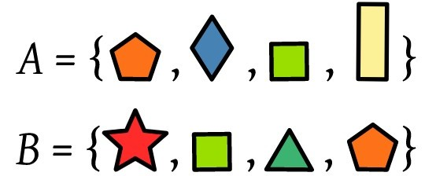

# STC [csset](../include/stc/csset.h): Sorted Set


A **csset** is an associative container that contains a sorted set of unique objects of type *i_key*. Sorting is done using the key comparison function *keyCompare*. Search, removal, and insertion operations have logarithmic complexity. **csset** is implemented as an AA-tree.

See the c++ class [std::set](https://en.cppreference.com/w/cpp/container/set) for a functional description.

## Header file and declaration

```c
#define i_type      // full typename of the container
#define i_key       // key: REQUIRED
#define i_cmp       // three-way compare two i_keyraw* : REQUIRED IF i_keyraw is a non-integral type
#define i_keydrop   // destroy key func - defaults to empty destruct
#define i_keyclone  // REQUIRED IF i_keydrop defined

#define i_keyraw    // convertion "raw" type - defaults to i_key
#define i_keyfrom   // convertion func i_keyraw => i_key - defaults to plain copy
#define i_keyto     // convertion func i_key* => i_keyraw - defaults to plain copy

#define i_cmp_functor // advanced, see examples/functor.c for similar usage.
#define i_tag       // alternative typename: csset_{i_tag}. i_tag defaults to i_val
#include <stc/csset.h>
```
`X` should be replaced by the value of `i_tag` in all of the following documentation.

## Methods

```c
csset_X              csset_X_init(void);
csset_X              csset_X_with_capacity(intptr_t cap);
bool                 csset_X_reserve(csset_X* self, intptr_t cap);
void                 csset_X_shrink_to_fit(csset_X* self);
csset_X              csset_X_clone(csset_x set);

void                 csset_X_clear(csset_X* self);
void                 csset_X_copy(csset_X* self, const csset_X* other);
void                 csset_X_drop(csset_X* self);                                             // destructor

intptr_t             csset_X_size(const csset_X* self);
bool                 csset_X_empty(const csset_X* self);

const csset_X_value* csset_X_get(const csset_X* self, i_keyraw rkey);                         // const get
csset_X_value*       csset_X_get_mut(csset_X* self, i_keyraw rkey);                           // return NULL if not found
bool                 csset_X_contains(const csset_X* self, i_keyraw rkey);
csset_X_iter         csset_X_find(const csset_X* self, i_keyraw rkey);
csset_X_value*       csset_X_find_it(const csset_X* self, i_keyraw rkey, csset_X_iter* out);  // return NULL if not found
csset_X_iter         csset_X_lower_bound(const csset_X* self, i_keyraw rkey);                 // find closest entry >= rkey

csset_X_result       csset_X_insert(csset_X* self, i_key key);
csset_X_result       csset_X_push(csset_X* self, i_key key);                                  // alias for insert()
csset_X_result       csset_X_emplace(csset_X* self, i_keyraw rkey);

intptr_t             csset_X_erase(csset_X* self, i_keyraw rkey);
csset_X_iter         csset_X_erase_at(csset_X* self, csset_X_iter it);                        // return iter after it
csset_X_iter         csset_X_erase_range(csset_X* self, csset_X_iter it1, csset_X_iter it2);  // return updated it2

csset_X_iter         csset_X_begin(const csset_X* self);
csset_X_iter         csset_X_end(const csset_X* self);
void                 csset_X_next(csset_X_iter* it);

csset_X_value        csset_X_value_clone(csset_X_value val);
```

## Types

| Type name          | Type definition                                   | Used to represent...        |
|:-------------------|:--------------------------------------------------|:----------------------------|
| `csset_X`          | `struct { ... }`                                  | The csset type              |
| `csset_X_rawkey`   | `i_keyraw`                                        | The raw key type            |
| `csset_X_raw`      | `i_keyraw`                                        | The raw key type            |
| `csset_X_key`      | `i_key`                                           | The key type                |
| `csset_X_value`    | `i_key        `                                   | The value: key is immutable |
| `csset_X_result`   | `struct { csset_X_value* ref; bool inserted; }`   | Result of insert/emplace    |
| `csset_X_iter`     | `struct { csset_X_value *ref; ... }`              | Iterator type               |

## Example
```c
#include <stc/cstr.h>

#define i_key_str
#include <stc/csset.h>

int main ()
{
    c_auto (csset_str, first, second, third)
    c_auto (csset_str, fourth, fifth)
    {
        second = c_make(csset_str, {"red", "green", "blue"});

        c_forlist (i, const char*, {"orange", "pink", "yellow"})
            csset_str_emplace(&third, *i.ref);

        csset_str_emplace(&fourth, "potatoes");
        csset_str_emplace(&fourth, "milk");
        csset_str_emplace(&fourth, "flour");

        fifth = csset_str_clone(second);
        c_foreach (i, csset_str, third)
            csset_str_emplace(&fifth, cstr_str(i.ref));
        c_foreach (i, csset_str, fourth)
            csset_str_emplace(&fifth, cstr_str(i.ref));

        printf("fifth contains:\n\n");
        c_foreach (i, csset_str, fifth)
            printf("%s\n", cstr_str(i.ref));
    }
}
```
Output:
```
fifth contains:

blue
flour
green
milk
orange
pink
potatoes
red
yellow
```
